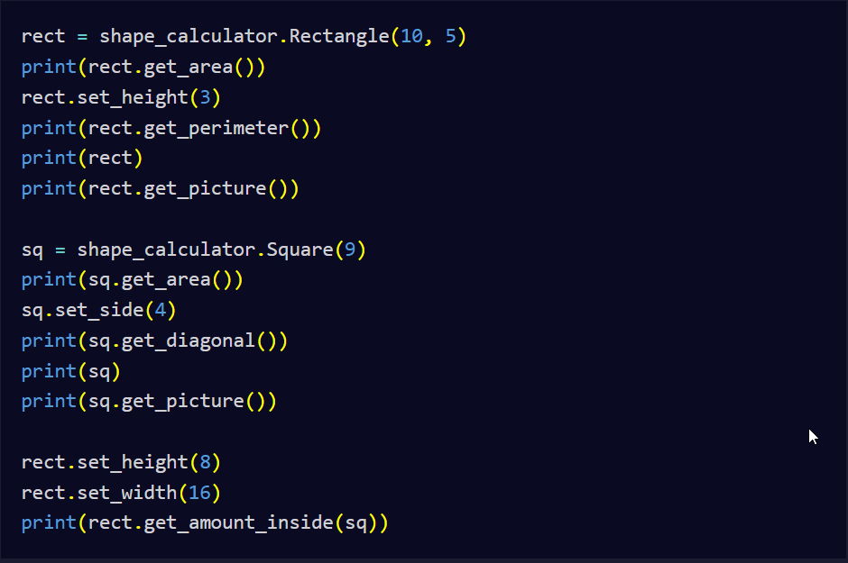
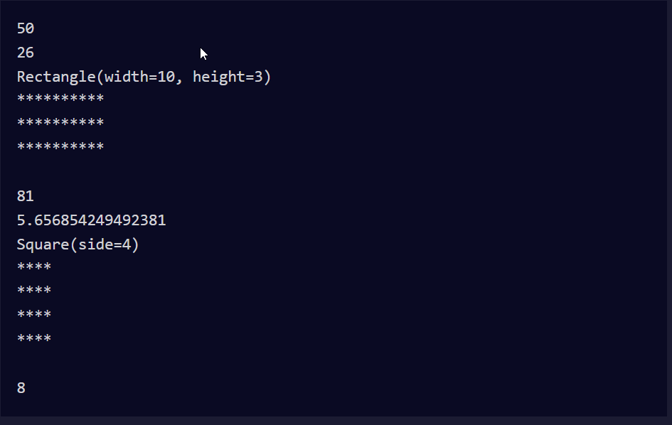

In this project you will use object oriented programming to create a Rectangle class and a Square class. The Square class should be a subclass of Rectangle and inherit methods and attributes.

## Rectangle class
When a Rectangle object is created, it should be initialized with width and height attributes. The class should also contain the following methods:

+ set_width
+ set_height
+ get_area: Returns area (width * height)
+ get_perimeter: Returns perimeter (2 * width + 2 * height)
+ get_diagonal: Returns diagonal ((width ** 2 + height ** 2) ** .5)
get_picture: Returns a string that represents the shape using lines of "*". The number of lines should be equal to the height and the number of "*" in each line should be equal to the width. There should be a new line (\n) at the end of each line. If the width or height is larger than 50, this should return the string: "Too big for picture.".
+ get_amount_inside: Takes another shape (square or rectangle) as an argument. Returns the number of times the passed in shape could fit inside the shape (with no rotations). For instance, a rectangle with a width of 4 and a height of 8 could fit in two squares with sides of 4.

Additionally, if an instance of a Rectangle is represented as a string, it should look like: Rectangle(width=5, height=10)

## Square class
The Square class should be a subclass of Rectangle. When a Square object is created, a single side length is passed in. The` __init__` method should store the side length in both the width and `height` attributes from the Rectangle class.

The Square class should be able to access the Rectangle class methods but should also contain a `set_side` method. If an instance of a Square is represented as a string, it should look like: `Square(side=9)`

Additionally, the `set_width` and `set_height` methods on the Square class should set both the width and height.

## Usage example

## That code should return:

## Test Passed:
